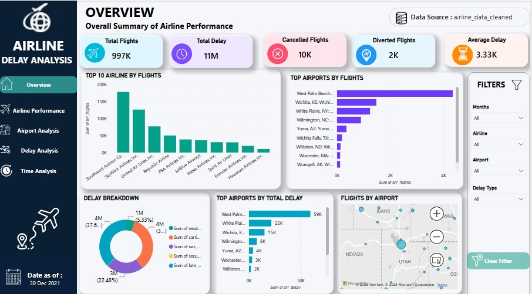
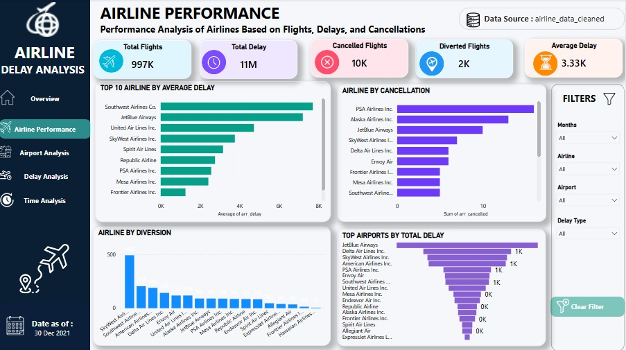
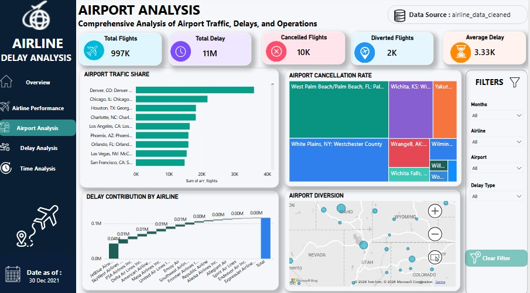
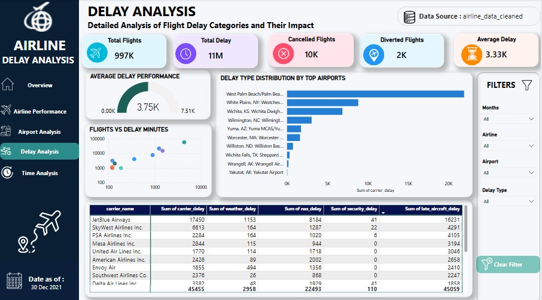
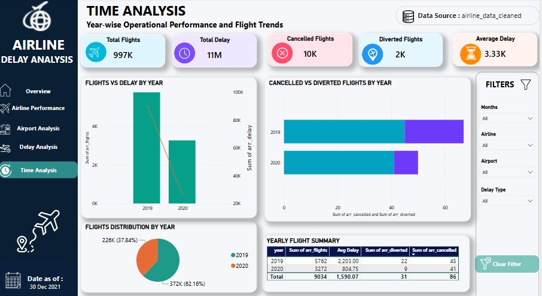

# Airline Delay Analysis Dashboard

A comprehensive, interactive Data Analysis project built using Python (for data processing) and Microsoft Power BI (for advanced business intelligence and visualization). This dashboard provides deep operational insights into flight delays, cancellations, and overall airline performance.

---

## Project Structure
*   `Airline_Delay_Analysis_Dashboard.pbix` - The core Microsoft Power BI dashboard file.
*   `airlinedata.py` - Python script containing the data analysis/cleaning workflow.
*   `Overview.jpg.jpeg` - Screenshot of the Overview analytical view.
*   `airline_performance.jpg.jpeg` - Screenshot of the Airline Performance analytical view.
*   `airport_analysis.jpg.jpeg` - Screenshot of the Airport Analysis analytical view.
*   `delay_analysis.jpg.jpeg` - Screenshot of the Delay Analysis analytical view.
*   `time_analysis.jpg.jpeg` - Screenshot of the Time Analysis analytical view.

---

## Dashboard Architecture and Key Pages

The dashboard is structured into 5 dedicated analytical views, accessible via a custom vertical corporate navigation system:

### 1. Overview Page
Purpose: High-level executive summary of operational traffic and overall efficiency.
Key Metrics (KPIs): Total Flights, Total Delay (Minutes), Cancelled Flights, Diverted Flights, and Average Delay.
Visuals: Flight volume trend over time, delay breakdown by type, Top 10 Airlines by Volume, and geospatial flight distribution mapping.

---

### 2. Airline Performance Page
Purpose: Deep-dive report card assessing specific carriers based on flights, delays, and cancellations.
Visuals: Detailed horizontal bar charts tracking Average Delay and Cancellations by specific airlines, along with clustered column charts analyzing flight diversions to rank top and worst performers.

---

### 3. Airport Analysis Page
Purpose: Comprehensive analysis of airport traffic, workload share, delays, and operations across domestic hubs.
Visuals: Treemaps for cancellation rates by location, traffic share analysis, and a waterfall chart visualizing cumulative delay contributions by airline across major airports.

---

### 4. Delay Analysis Page
Purpose: Granular breakdown of the root causes of operational friction and flight delay categories.
Visuals: Advanced relationships plotted via Scatter Charts (Total Flights vs Total Delay Minutes), Gauges tracking Average Delay metrics, and custom Stacked Bar Charts mapping specific delay categories (Carrier, NAS, Weather, Security, Late Aircraft) across top hubs.

---

### 5. Time Analysis Page
Purpose: Longitudinal operational tracking across multiple yearly intervals (2019 vs 2020) to monitor trends.
Visuals: Comparative annual volume bar charts, segmented stacked horizontal charts showing internal operational distribution change, and macro flight distribution pie charts.

---

## Tech Stack 
*   Data Processing: Python (Pandas)
*   BI and Analytics Engine: Microsoft Power BI Desktop
